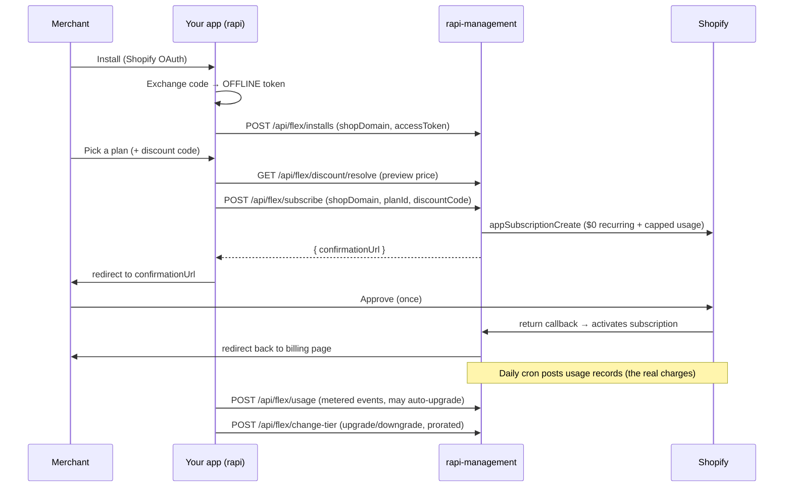

# rapi-management — App Integration Guide

This guide is for engineers building a Shopify app (e.g. **rapi**) that uses
**rapi-management** as its billing backend. rapi-management is a standalone
billing platform: your app keeps its own Shopify OAuth and UI,
and delegates *subscriptions, proration, trials, discounts, and usage-based
tiering* to the platform over a small HTTP API.

The platform bills using Shopify **flex billing** — a $0 recurring price plus
usage records against a capped line — so tier changes never trigger Shopify's
re-approval screen.

---

## 1. Concepts

| Entity | What it is |
|---|---|
| **App** | Your Shopify app as registered on the platform. Holds your Shopify API key/secret and issues you a **platform API key** for these endpoints. |
| **Install** | One merchant's installation of your app. Holds that shop's **offline access token**, which is how the platform bills on the merchant's behalf. |
| **Plan** | A pricing tier (one plan per tier). Created in the platform dashboard. |
| **Subscription** | A merchant's active plan. The platform owns the billing clock. |
| **Discount** | A code-based discount created in the dashboard; your app applies it by code. |

**Who owns what:** your app owns OAuth, the merchant UI, and metered-usage
reporting. The platform owns the money — it creates the Shopify subscription,
runs a daily charge cron, prorates plan changes, and applies discounts.

**Important:** there is **no synchronous "charge now"**. Shopify sends no billing
webhook, so the platform charges each subscription on a **daily cron** in advance
of each period. Your calls set *state* (subscribe, change tier, report usage);
the actual charges happen on the platform's schedule.

---

## 2. Before you start

1. In the platform dashboard, go to **`/app/apps` → Register app** and enter your
   Shopify **API key** and **API secret**.
2. Open the app's detail page. Copy three values:
   - **Platform API key** — your bearer token for every call below.
   - **Install-sync endpoint** — `POST {PLATFORM}/api/flex/installs`.
   - **Uninstall webhook URL** — `{PLATFORM}/webhooks/{yourAppHandle}/uninstalled`.
3. Set that webhook URL as your Shopify app's `APP_UNINSTALLED` webhook.

Throughout this doc, `{PLATFORM}` is the platform base URL (e.g.
`https://billing.yourco.com`) and `{API_KEY}` is your platform API key.

---

## 3. Authentication

Every `/api/flex/*` call is authenticated with your platform API key, sent as
either header:

```
Authorization: Bearer {API_KEY}
```
or
```
X-Api-Key: {API_KEY}
```

POST bodies are JSON; send `Content-Type: application/json`.

Auth failures return `401` (missing/invalid key) or `403` (app disabled).

---

## 4. Integration lifecycle



### 4.1 Sync the install (after OAuth)

After your app completes Shopify OAuth and has the merchant's **offline** access
token, register it with the platform:

```bash
curl -X POST "{PLATFORM}/api/flex/installs" \
  -H "Authorization: Bearer {API_KEY}" -H "Content-Type: application/json" \
  -d '{"shopDomain":"acme.myshopify.com","accessToken":"shpat_…","shopPlatformId":"123456","scope":"read_orders"}'
```

Call this again whenever the token changes (re-install, scope change) — it upserts
and clears any prior uninstall. **Use the offline token**, not an online one — the
platform bills outside any user session.

### 4.2 Show plans and (optionally) preview a discount

```bash
curl "{PLATFORM}/api/flex/plans" -H "Authorization: Bearer {API_KEY}"
```

If the merchant enters a discount code, preview the discounted price before
subscribing:

```bash
curl "{PLATFORM}/api/flex/discount/resolve?code=LAUNCH20&planId={planId}" \
  -H "Authorization: Bearer {API_KEY}"
```

### 4.3 Create the subscription

```bash
curl -X POST "{PLATFORM}/api/flex/subscribe" \
  -H "Authorization: Bearer {API_KEY}" -H "Content-Type: application/json" \
  -d '{"shopDomain":"acme.myshopify.com","planId":"{planId}","discountCode":"LAUNCH20"}'
# → { "subscriptionId": "…", "confirmationUrl": "https://acme.myshopify.com/admin/…/confirm" }
```

**Persist `subscriptionId`** (you'll need it for `change-tier`), then redirect the
merchant to `confirmationUrl`. They approve **once**.

### 4.4 The return callback

`confirmationUrl` sends the merchant to Shopify's approval screen. On approval,
Shopify redirects to the platform's return callback, which confirms the
subscription is active, activates it locally, and redirects the merchant to the
platform's billing page. You don't implement this — but note the merchant leaves
your app briefly during approval and comes back activated.

### 4.5 Report metered usage

If your plans use usage-based tiering, report metered events. Crossing a plan's
`limitMax` automatically upgrades the merchant to the next tier (prorated), with
no re-approval:

```bash
curl -X POST "{PLATFORM}/api/flex/usage" \
  -H "Authorization: Bearer {API_KEY}" -H "Content-Type: application/json" \
  -d '{"shopDomain":"acme.myshopify.com","metric":"orders","quantity":1}'
# → { "recorded": true, "upgraded": false }
```

### 4.6 Change plans (upgrade / downgrade)

```bash
curl -X POST "{PLATFORM}/api/flex/change-tier" \
  -H "Authorization: Bearer {API_KEY}" -H "Content-Type: application/json" \
  -d '{"subscriptionId":"…","newPlanId":"{planId}"}'
```

Two possible responses — **handle both**:

```json
{ "status": "changed", "subscriptionId": "…" }
```
The change applied in place (prorated), no merchant action needed. Note the
returned `subscriptionId` is the **new** subscription id — store it.

```json
{ "status": "confirmation_required", "subscriptionId": "…", "confirmationUrl": "…" }
```
Rare: the upgrade proration couldn't fit under the usage cap, so a fresh Shopify
subscription is needed. Redirect the merchant to `confirmationUrl`.

### 4.7 Handle uninstall

Configure the `APP_UNINSTALLED` webhook (section 2) — the platform marks the
install uninstalled and stops billing it. If you also want to signal it
explicitly:

```bash
curl -X DELETE "{PLATFORM}/api/flex/installs" \
  -H "Authorization: Bearer {API_KEY}" -H "Content-Type: application/json" \
  -d '{"shopDomain":"acme.myshopify.com"}'
```

---

## 5. API reference

All paths are relative to `{PLATFORM}`. All require the auth header (section 3)
except the return callback and webhook.

### `POST /api/flex/installs`
Register or refresh a merchant install.

| Body field | Type | Notes |
|---|---|---|
| `shopDomain` | string (required) | `acme.myshopify.com` |
| `accessToken` | string | The merchant's **offline** token |
| `shopPlatformId` | string | Numeric Shopify shop id (for Partner-API credits) |
| `scope` | string | Granted scopes |

`200 → { installId, shopDomain, billingUrl, billingAccessExpiresAt }`

### `DELETE /api/flex/installs`
Body: `{ "shopDomain": "…" }`. Marks the install uninstalled. `200 → { ok: true }`

### `POST /api/flex/subscribe`

| Body field | Type | Notes |
|---|---|---|
| `shopDomain` | string (required) | |
| `planId` | string (required) | |
| `discountCode` | string | Optional |
| `test` | boolean | Optional — creates a Shopify **test** subscription (no real charges) |

`200 → { subscriptionId, confirmationUrl }`
Errors: `404` install not found / discount code not found; `400` plan invalid.

### `POST /api/flex/change-tier`

| Body field | Type | Notes |
|---|---|---|
| `subscriptionId` | string (required) | |
| `newPlanId` | string (required) | |
| `discountId` | string | Optional; else the active discount transfers |

`200 → { status: "changed", subscriptionId }`
or `{ status: "confirmation_required", subscriptionId, confirmationUrl }`
Errors: `404` subscription not found / not owned by your app.

### `POST /api/flex/usage`

| Body field | Type | Notes |
|---|---|---|
| `shopDomain` | string (required) | |
| `metric` | string (required) | Must match the plan's `limitMetric` to drive auto-upgrade |
| `quantity` | number \| string (required) | |

`200 → { recorded: true, upgraded: boolean }`

### `GET /api/flex/discount/resolve`
Query: `code` (required), `planId` (optional).

Valid: `{ valid: true, discount: { id, code, type, value, discountMethod, durationIntervals }, priced: { planId, listPrice, discountedPrice } | null }`
Invalid: `{ valid: false }`

`type` is `PERCENTAGE | AMOUNT | FLAT_PRICE`; `discountMethod` is
`PRICE_REDUCTION | APP_CREDITS`. Prices are decimal strings.

### `GET /api/flex/subscription/:id`
`200 → { id, status, test, plan: { id, name, amount }, currencyCode,
currentPeriodStart, currentPeriodEnd, nextBillingDate, trialEndsAt, activatedAt,
canceledAt, pausedUntil }`. `status` is `PENDING | ACTIVE | FROZEN | CANCELLED |
DECLINED | EXPIRED`.

### `GET /api/flex/plans`
`200 → { plans: [ { id, name, amount, currencyCode, interval, trialDays,
flexBilling, usageChargeCappedAmount, onUsageLimitReached, limitMetric, limitMax } ] }`

---

## 6. Webhooks

The platform registers only **`APP_UNINSTALLED`**. You configure your Shopify app
to send it to `{PLATFORM}/webhooks/{yourAppHandle}/uninstalled`; the platform
verifies the HMAC with your app secret and marks the install uninstalled. You do
not call this endpoint.

---

## 7. Conventions

- **Money** is always a **decimal string** in the plan's currency (`"49.00"`).
- **Errors** are JSON: `{ "error": "message" }`, with `4xx` status. Validation
  failures add `{ "issues": [...] }`. Always check the status code.
- **Idempotency:** `installs` upserts by `(app, shopDomain)`. `subscribe` creates
  a new subscription each call — don't retry blindly; store the `subscriptionId`.
- **No API versioning yet** — the API is pre-1.0 and may change; pin to this doc's
  shape and watch for change notes.

---

## 8. Gotchas / FAQ

- **Use the offline access token.** The platform charges via a background cron,
  not during a user session; an online token won't work.
- **First charge isn't immediate.** After approval the first charge is posted on
  the next daily cron run, billed *in advance* for period one. Don't expect a
  charge during `subscribe`.
- **Always handle `confirmation_required`** from `change-tier`, even though it's
  rare — otherwise a cap-full upgrade silently stalls.
- **Trials are platform-side.** Set `trialDays` on the plan in the dashboard, not
  in the API. Shopify never sees the trial.
- **Test mode:** pass `test: true` to `subscribe` for a Shopify test subscription
  during development — usage records are posted but never actually charged.
- **You need `subscriptionId` for `change-tier`.** Persist the id returned by
  `subscribe` (and by any prior in-place change), or fetch state via
  `GET /api/flex/subscription/:id`.
- **Downgrade credits** require the platform's Partner-API credentials to be
  configured; if they aren't, downgrades still apply but no credit is issued.
